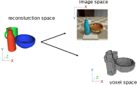

# Data formats and coordinate systems

This document explains CoReNet's data formats, as well its various
coordinate systems. You can also check the
[data_loading_transformation_and_rendering.ipynb](data_loading_transformation_and_rendering.ipynb)
notebook, which shows how to read data, transform between coordinate systems,
and render scenes and voxel grids.

## Scene fields
CoReNet's datasets consist of synthetic 3D scenes, assembled from
[ShapeNet](https://shapenet.org/) meshes.
Each scene is contained in a single numpy NPZ file, with the following
fields:
* `scene_filename: bytes[]` A unique scene name.
* `mesh_labels: str[num_objects]` Semantic labels for each object in the scene.
* `mesh_filenames: str[num_objects]` The ShapeNet mesh file name
   for each object in the scene.
* `mesh_visible_fractions: float[num_objects]` The fraction of each object that
   is visible for the chosen camera view.
* `mesh_object_to_world_transforms: float[num_objects, 4, 4]` The placement
   of each object in the scene. See below for more details.
* `view_transform: float[4, 4]` World 🡒 reconstruction space
   transformation. See below for  more details.
* `camera_transform: float[4, 4]` Reconstruction 🡒 image space
   transformation. See below for more details.
* `opengl_image: bytes[]` A low-realism image rendered from the chosen view
   and encoded as WebP.
* `pbrt_image` A high-realism image rendered from the chosen view and encoded
   as WebP.

The NPZ scene files don't contain actual geometry themselves, but rather point
to ShapeNet meshes, through the `mesh_labels` and `mesh_filenames` fields.

## Transformation encoding
CoReNet uses 4x4 matrices to encode transformations. A point
`p=(x, y, z)` is transformed by matrix `M = (m11, m12, ... m44)` to point
`p'=(x', y', z')` using the following equations:

```
⎧x"⎫   ⎧ m11 m12 m13 m14 ⎫   ⎧x⎫
⎪y"⎪ = ⎪ m21 m22 m23 m24 ⎪ · ⎪y⎪
⎪z"⎪   ⎪ m31 m32 m33 m34 ⎪   ⎪z⎪
⎩w"⎭   ⎩ m41 m42 m43 m44 ⎭   ⎩1⎭

     ⎧x'⎫   ⎧x" / w"⎫
p' = ⎪y'⎪ = ⎪y" / w"⎪
     ⎩z'⎭   ⎩z" / w"⎭
```
Beside linear transformations, this representation allows encoding affine
transformations (such as translation), as well as camera projections (both
perspective and orthographic).

Transformations are concatenated using matrix multiplication. For example,
rotation with matrix `R`, followed by translation `T`, followed by
projection `P` can be expressed as a single matrix equal to `P·T·R`. We use
the following standard transformations in equations below:
```
                    ⎧ sx  0  0  0 ⎫                           = ⎧  1  0  0 tx ⎫
scale(sx, sy, sz) = ⎪  0 sy  0  0 ⎪ ,   translate(tx, ty, tz) = ⎪  0  1  0 ty ⎪
                    ⎪  0  0 sz  0 ⎪                           = ⎪  0  0  1 tz ⎪
                    ⎩  0  0  0  1 ⎭                           = ⎩  0  0  0  1 ⎭
```


### Coordinate systems


CoReNet uses a number of coordinate systems.
Each object lives in its own coordinate system/space. It is placed in the
scene (world space) through the `mesh_object_to_world_transforms` field, which
contains the object 🡒 world transformation.




The output of CoReNet is contained in reconstruction space, and
`view_transform` specifies the world 🡒 reconstruction space transformation.

The reconstruction 🡒 image space transformation is stored in
`camera_transform`. In image space, `x` points right and `y` points down. The
top-left corner of the image has coordinates `(-1, -1)`, while the bottom-right
corner has coordinates `(1, 1)`.

CoReNet also uses a voxel space internally to define the voxel grid. Voxel
`(i, j, k)` in the grid occupies the cube `(i, j, k) - (i+1, j+1, k+1)` in
voxel space.
The reconstruction 🡒 voxel space transformation is hard-coded, with
`view_to_voxel = scale(W, H, D)`, where `W`, `H`, and `D` are the grid's width,
height, and depth. Because of this, CoReNet only reconstructs geometry contained
in the unit cube in reconstruction space.

All transformation matrices above can be arbirtrary, as long as they are
invertible. Historically, CoReNet also required that reconstruction happens in
view space (hence the `view_...` naming for reconstuction space
transformations), but this is no longer the case.

In the data released with CoReNet, the reconstruction space is
aligned with the camera. That is, `x` and `y` in reconstruction space are
parallel to `x` and `y` in image space, whereas `z` is perpendicular to the
image, pointing forward (or "inside"). The `camera_transform` for all scenes in
the data is computed using:

```python
import math
import corenet.geometry.transformations as tt
proj_mat = tt.perspective_rh(
  math.pi * 60 / 180, aspect=1, z_near=0.0001, z_far=10)
look_at_mat = tt.look_at_rh(
  [0.5, 0.5, -1.3666666 + 0.5], [0.5, 0.5, 0.5], [0, -1, 0])
camera_transform = proj_mat @ look_at_mat
```

## Often used transformations
Below are the equations for several often-used transformations. Some of them
are also implemented in the
[data_loading_transformation_and_rendering.ipynb](data_loading_transformation_and_rendering.ipynb)
notebook.


The transformation matrix to project a point `p` on object `i` to a pixel
`p'` on the image is given by:
```
object_to_pixel = (
    scale(w/2, h/2, 1) · translate(1, 1, 0) · camera_transform ·
    view_transform · mesh_object_to_world_transforms[i])
```
where `w` and `h` are the image's width and height.
Note that `p'` contains real values. The integer part of it
contains the pixel coordinates, the fractional part - the point location
within the pixel.

To project the center of voxel `p=(i, j, k)` to a pixel, use:
```
voxel_center_to_pixel = (
    scale(w/2, h/2, 1) · translate(1, 1, 0) · camera_transform ·
    scale(1/W, 1/H, 1/D) · translate(0.5, 0.5, 0.5)
)
```
where `W`, `H`, and `D` are the resolution of the grid (width, height, depth).

To transform point `p` in world space to `p'` in voxel space and vice-versa,
use:
```
world_to_voxel = scale(W, H, D) · view_transform
voxel_to_world = view_transform⁻¹ · scale(1/W, 1/H, 1/D)
```
